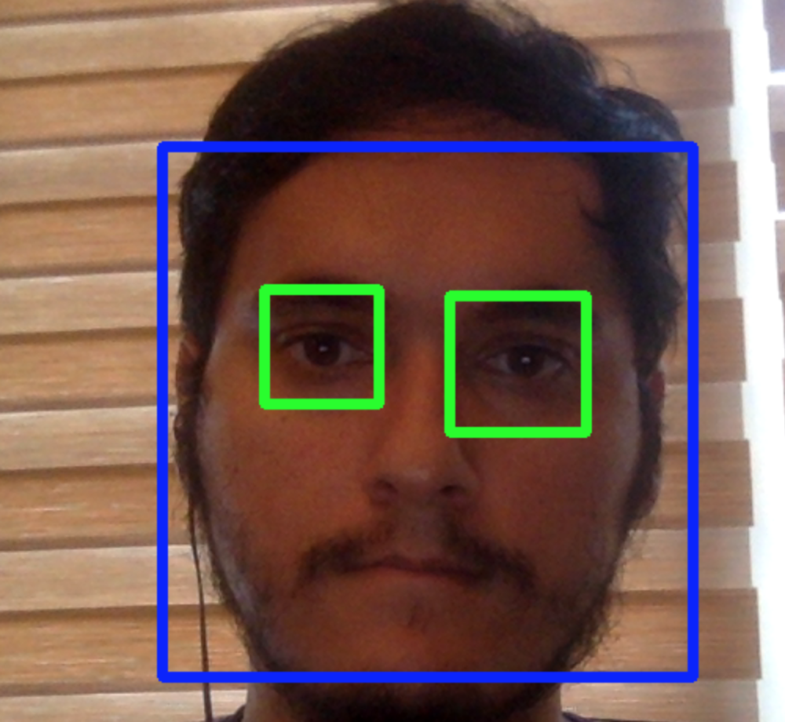

# Webcam Face and Eye Detection
 Using OpenCV and Python to create a facial and eye detection

With the greater need for images to detect facial structures in real time, I have developed an app using openCV to detect facial structures. 

This requires a working camera, Python, and openCV

I used a haar cascade to be able to detect faces and eyes. When openCV captures a frame, the haarcascade runs through the image and detects any faces present. From there, a simple rectangle is drawn across the face and eyes. Since it is done with the camera, it is done in real time. However, openCV can be connected to any other camera on your system. 

If you are able to run the code, you should receive a sample like: 
